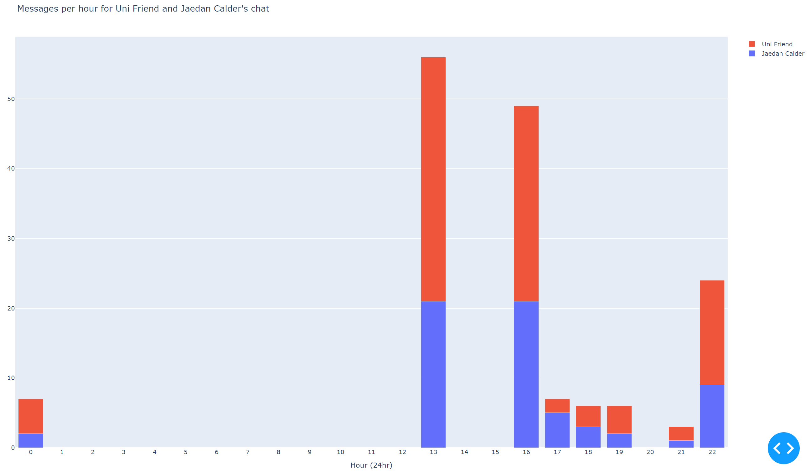
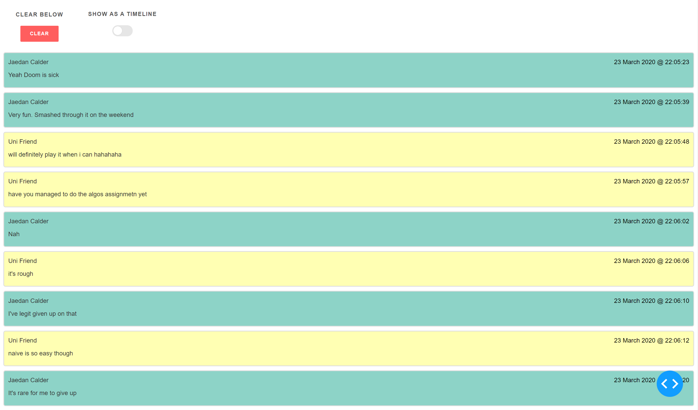

# Interactive Messenger Stats

This program uses the `json` data that can be downloaded from Facebook to live graph interesting statistics about your conversations. This supports group chats too.





## Installation

- First, follow this link [https://www.facebook.com/dyi/?referrer=yfi_settings](https://www.facebook.com/dyi/?referrer=yfi_settings). This will take you to the page where you can download your Messenger Data. You can also find this page on Facebook under `?` -> Settings -> Your Facebook information -> Download your information

- Under "Request Copy", set "Date range" to the range you are interested in. Then set "Format" to "JSON" and set "Media Quality" to Low, to reduce file size.


- Under "Your information" click on "Deselect all", then scroll down to check only "Messages".


- Click on "Create File". This process usually take around an hour to complete and you will get a notification when your data is ready to be downloaded.

- Download the Zip file containing all your conversations.

- Once you have your messenger data zip file, extract the contents to where ever you like.

Inside you will find a file structure that looks like this.

```ini
📂messages
┣ 📂archived_threads
┣ 📂filtered_threads
┗ 📂inbox
  ┣ 📂<convo1>_<some_random_text>
  ┣ 📂<convo2>_<some_random_text>
  ┗ 📂...
```

- Move the `inbox` folder from what you downloaded into the `messages` folder in my repository.

- Install the dependencies for this project.

```bash
pip install -r requirements.txt
```

## How to use Interactive Messenger Stats

There are two ways to tell my program to graph a conversation.

- `to_graph.txt` file

    Place the name of your conversation inside the `to_graph.txt` file like the example provided. The name of your conversation is the name of the folders containing the `message_1.json` files. You can add multiple names to the `to_graph.txt` on each line.

- In `run.py`

    OR Find the line I commented: `conversations.append(load_conversation("MyChat_abc123abc123"))`, and uncomment the line. Change the string to be the name of the folder like above. You can append multiple if you want.

Then run the program.

```bash
python run.py
```

Then navigate to where the Dash App is hosted at:

[http://localhost:8050/](http://localhost:8050/)

You can click on bars or dots on the graph to see more graphs or messages.


### For Developers

The `Message` and `MessengerConversation` classes inside `messenger.py` are very extensive in how they work. The `main` function in `messenger.py` goes over some useful ways to access your data. I've tried to provide docstrings to help you follow my code. Please consider looking at this resource if you are unfamiliar:

- [Counter](https://docs.python.org/3/library/collections.html#collections.Counter) datatype

I'm never going to try and wrap a framework like Dash ever again because it kept me up very late for many nights trying to find workarounds for the system. I know I will look back at this wrapper and not have a clue how I did it.

This project was originally made for a friend of mine. I hope you enjoy what I have written. I was heavily inspired by [Facebook-Messenger-Statistics](https://github.com/simonwongwong/Facebook-Messenger-Statistics) by [Simon Wong](https://github.com/simonwongwong).
