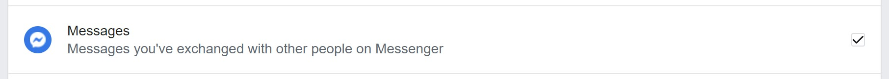

# MessengerStats

This program uses the `json` data that can be downloaded from Facebook to live graph interesting statistics about your conversations. This supports group chats too.

## Installation

- First, follow this link [https://www.facebook.com/dyi/?referrer=yfi_settings](https://www.facebook.com/dyi/?referrer=yfi_settings). This will take you to the page where you can download your Messenger Data. You can also find this page on Facebook under `?` -> Settings -> Your Facebook information -> Download your information

- Under "Request Copy", set "Date range" to the range you are interested in. Then set "Format" to "JSON" and set "Media Quality" to Low, to reduce file size.


- Under "Your information" click on "Deselect all", then scroll down to check only "Messages".



- Click on "Create File". This process usually take around an hour to complete and you will get a notification when your data is ready to be downloaded.

- Download the Zip file containing all your conversations.

- Once you have your messenger data zip file, extract the contents to where ever you like.

Inside you will find a file structure that looks like this.

```ini
📂messages
┣ 📂archived_threads
┣ 📂filtered_threads
┣ 📂inbox
┃ ┣ 📂<convo1>_<some_random_text>
┃ ┣ 📂<convo2>_<some_random_text>
┃ ┣ 📂<convo3>_<some_random_text>
┃ ┗ 📂...
┣ 📂message_requests
┗ 📂stickers_useds
```

- Move the `inbox` folder from what you downloaded into the `messages` folder in my repository.

- Install the dependencies for this project.

```bash
$ pip install -r requirements.txt
```

## How to use MessengerStats

There are two ways to tell my program to graph a conversation.

- `to_graph.txt` file
- In `run.py`

### Method 1: `to_graph.txt` file

### Method 2: In `run.py`

### For Developers

The Message and MessengerConversation classes inside `messenger.py` are very extensive in how they work. The `main` function in `messenger.py` goes over some useful ways to access your data. I've tried to provide docstrings to help you follow my code. Please consider looking at this resource if you are unfamiliar:

- [Counter](https://docs.python.org/3/library/collections.html#collections.Counter) datatype

This project was originally made for a friend of mine. I hope you enjoy what I have written and it was heavily inspired by [Facebook-Messenger-Statistics](https://github.com/simonwongwong/Facebook-Messenger-Statistics) by [Simon Wong](https://github.com/simonwongwong).
